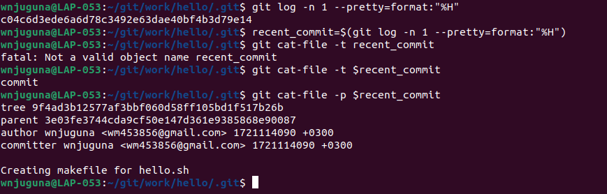

# REPORT FOR THE GIT PROJECT.

## Setting up git.

### Installation.
To install git open the terminal and run the following command;

```bash
sudo apt install git-all
```
Though this is the command for installing git on my local machine, git was already installed.


### Configuration.

Configure your email address and username on git.


## Git commits to commit.
Create a subdirectory named hello in work directory and inside it a file titled hello.sh with the following content 'echo "Hello, World"' .

```bash
mkdir hello
cd hello
echo 'echo "Hello, World"' > hello.sh
cat hello.sh
```

The output will be as follows:
```bash
echo "Hello, World"
```


Initialize git repository in the hello directory.


Check git status.


### Change the contents of hello.sh.


### Modify hello.sh content.
First commit is to add a comment to line three. Used nano text editor for this part.


For the second commit which changes the content of line 4 and 5, I used nano to make the changes


## History.
### Show history of working directory.


### Show one-line history with only commit hashes and messages.


### Controlled entries


Since I had performed my commits a bit earlier than five minutes you can see the output was blank. But I have used the time variable of one hour so that you can have a better view of the output.

### Personalized format.
Show logs in a personalized format including commit hash, date, message, branch information and author name: * e4e3645 2023-06-10 | Added a comment (HEAD -> main) [John Doe].


## Check it out.
### Restore First Snapshot.


### Resort Second. Recent Snapshot.


### Returning to Latest Version.


## TAG me.
### Referencing Current Version.


### Tagging Previous Version.


### Navigating Tagged Versions.


## Changed your mind?
### Reverting Changes.


### Staging and Cleaning.


### Commiting and Reverting.


 ### Tagging and Removing Commits.
 
 

### Displaying Logs with Deleted Commits.


### Cleaning Unreferenced Commits


### Author Information


## Move it
```bash
mkdir lib
git mv hello.sh lib/
touch Makefile
```


## Blobs, trees and commits
### Exploring .git/ Directory


### Latest Object Hash

